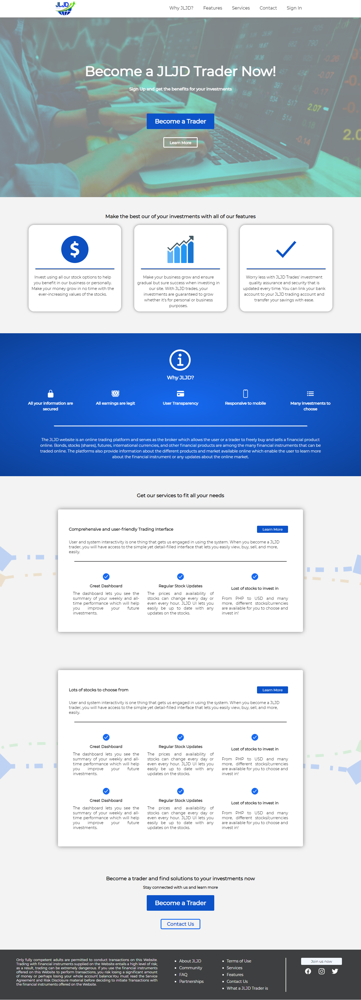
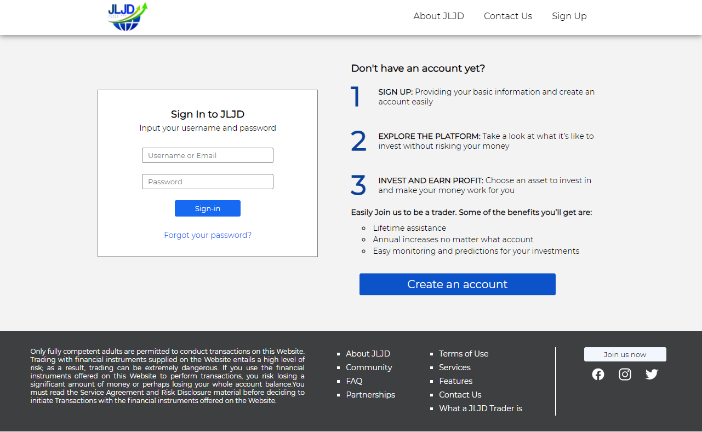
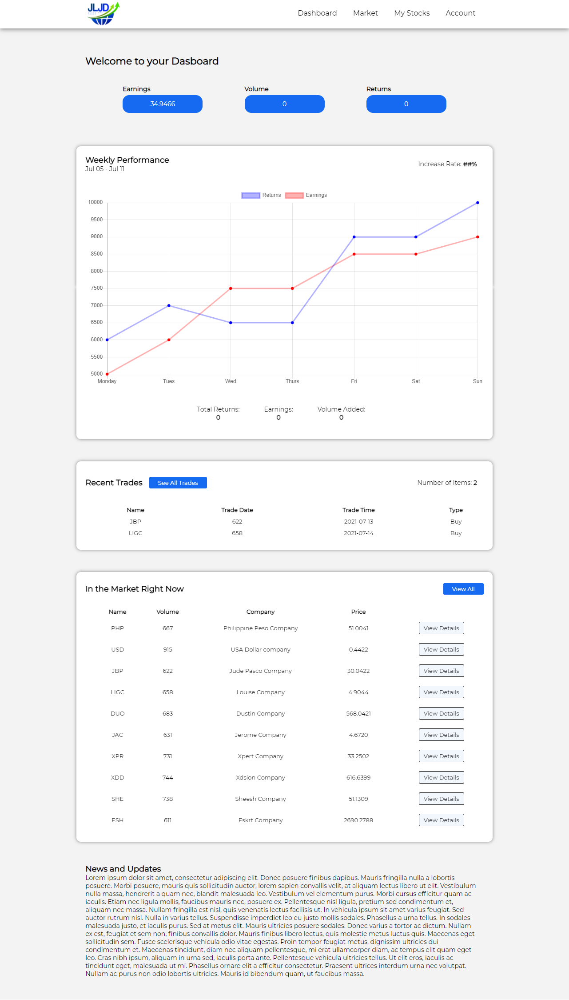
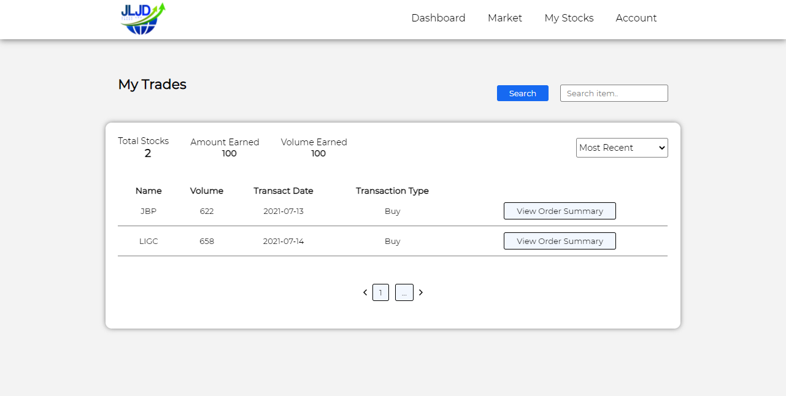

# jljd-stock-trade website

A CRUD system (school project in Web Development) that lets users create an account and trade stocks (No API).
The main purpose of this is mainly to develop a CRUD system, so a lot of functionalities of an actual stock trading system are missing.
In addition, simple security measurements were implemented as part of a requirement in Information Assurance and Security. 

**My Role:** Main Programmer and UI Designer

**Tools Used:** Plain HTML, CSS, JavaScript, and PHP with MySQL database 

## Sample Screenshots

